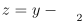
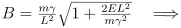
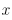
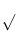

(app-b)=
# B. Derivations and Approximations

<!-- Source PDF page 283; printed label 274. -->

(sec-B-1)=
## B.1 Derivation of Elliptical Orbits

Starting from the energy equation for a central force ([Chapter 10](#ch-10)), we have

$$
E = \frac{1}{2} m\dot{r}^{2}+ U_{eff}
$$

where $U_{eff}$ is the effective potential. Re-arranging the equation gives:

$$
\dot{r}^{2}= \frac{2}{m} (E - U_{eff}) (\mathrm{B}.1)
$$

where $\dot{r} = \frac{\mathrm{d}r}{\mathrm{d}t}$. We want to get $r(\theta)$ to describe the orbit. To do this, we will use the ratio of $\dot{r}$ and $\dot{\theta}$ ,

$$
\frac{\dot{r}}{\dot{\theta}} = \frac{\mathrm{d}r/\mathrm{d}t}{\mathrm{d}\theta /\mathrm{d}t} = \frac{\mathrm{d}r}{\mathrm{d}\theta} (\mathrm{B}.2)
$$

So we need to get an equation for $\dot{\theta}$ .

For $\dot{\theta}$ , we can use the conservation of angular momentum. Recall that central forces conserve angular momentum by definition (see [Chapter 10](#ch-10)). The magnitude of angular momentum

$$
\mathrm{is}:
$$

$$
L = mr^{2}\dot{\theta} =\Rightarrow \dot{\theta} = \frac{L}{mr^{2}} (\mathrm{B}.3)
$$

with $L$ = constant.

We can then combine the $\dot{r}$ and $\dot{\theta}$ equations as follows:

$$
\Bigg(\frac{\mathrm{d}r}{\mathrm{d}\theta} \Bigg)^{2}= \frac{\dot{r}^{2}}{\dot{\theta}^{2}} =\Rightarrow \mathrm{from} \mathrm{Equation} \mathrm{B}.2
$$

$$
\Bigg(\frac{\mathrm{d}r}{\mathrm{d}\theta} \Bigg)^{2}= \frac{\frac{2}{m} (E - U_{eff})}{\Big(\frac{L}{mr^{2}} \Big)2} =\Rightarrow \mathrm{sub} \mathrm{in} \mathrm{Equations} \mathrm{B}.1 \mathrm{and} \mathrm{B}.3
$$

$$
\Bigg(\frac{\mathrm{d}r}{\mathrm{d}\theta} \Bigg)^{2}= \frac{2}{m} \frac{(E - U_{eff})}{L^{2}} (m^{2}r^{4})
$$

$$
\frac{1}{r^{4}} \Bigg(\frac{\mathrm{d}r}{\mathrm{d}\theta} \Bigg)^{2}= \frac{2m(E - U_{eff})}{L^{2}} =\Rightarrow \mathrm{bring} \mathrm{all} r \mathrm{terms} \mathrm{to} \mathrm{the} \mathrm{other} \mathrm{side}
$$

<!-- Source PDF page 284; printed label 275. -->

$$
\Bigg(\frac{1}{r^{2}} \frac{\mathrm{d}r}{\mathrm{d}\theta} \Bigg)^{2}= \frac{2m(E - U_{eff})}{L^{2}} =\Rightarrow \mathrm{simplify} \mathrm{the} \mathrm{LHS} \mathrm{of} \mathrm{the} \mathrm{equation} (\mathrm{B}.4)
$$

Equation B.4 applies to any effective potential. Since we’re talking about orbits, the central force is gravity. That makes the effective potential:

$$
U_{eff}= \frac{L^{2}}{2mr^{2}} - \frac{\gamma}{r} (\mathrm{B}.5)
$$

where $\gamma = GMm$ for simplicity. Substituting Equation B.5 into Equation B.4 gives,

$$
\Bigg(\frac{1}{r^{2}} \frac{\mathrm{d}r}{\mathrm{d}\theta} \Bigg)^{2}= \frac{2mE}{L^{2}} - \bigg(\frac{2m}{L^{2}} \bigg)\Bigg(\frac{L^{2}}{2mr^{2}} \Bigg) + \bigg(\frac{2m}{L^{2}} \bigg)\bigg(\frac{\gamma}{r} \bigg)
$$

$$
\Bigg(\frac{1}{r^{2}} \frac{\mathrm{d}r}{\mathrm{d}\theta} \Bigg)^{2}= \frac{2mE}{L^{2}} - \frac{1}{r^{2}} + \frac{2m\gamma}{rL^{2}} =\Rightarrow \mathrm{simplify} (\mathrm{B}.6)
$$

To solve Equation B.6, there is a substitution trick we can use to help simplify the problem. Instead of solving for $r$, we’re going to solve for $y = \frac{1}{r}$. The reason for this substitution is that

$$
\frac{\mathrm{d}y}{\mathrm{d}\theta} = - \frac{1}{r^{2}} \frac{\mathrm{d}r}{\mathrm{d}\theta} =\Rightarrow \mathrm{remember} \mathrm{that} y = \frac{1}{r}
$$

Thus, we can write Equation B.6 in terms of $y = \frac{1}{r}$ instead of $r$.

$$
\Bigg(\frac{\mathrm{d}y}{\mathrm{d}\theta} \Bigg)^{2}= \frac{2mE}{L^{2}} - y^{2}+ \frac{2m\gamma}{L^{2}} y =\Rightarrow \mathrm{sub} y = \frac{1}{r} \mathrm{into} \mathrm{Equations} \mathrm{B}.6 (\mathrm{B}.7)
$$

Already this looks simpler. We can simplify more, however, by “completing the square”,

$$
-\bigg(y - \frac{m\gamma}{L^{2}} \bigg)^{2}= -y^{2}+ \frac{2m\gamma}{L^{2}} y - \bigg(\frac{m\gamma}{L^{2}} \bigg)^{2}(\mathrm{B}.8)
$$

Note that the first two terms on the righthand side of Equation 8 are present in the righthand side of Equation B.7. From Equation B.8, we can say that

$$
-y^{2}+ \frac{2m\gamma}{L^{2}} = -\bigg(y - \frac{m\gamma}{L^{2}} \bigg)^{2}+ \bigg(\frac{m\gamma}{L^{2}} \bigg)^{2}(\mathrm{B}.9)
$$

And we can substitute Equation B.9 into Equation B.7 to give:

$$
\Bigg(\frac{\mathrm{d}y}{\mathrm{d}\theta} \Bigg)^{2}= \frac{2mE}{L^{2}} - \bigg(y - \frac{m\gamma}{L^{2}} \bigg)^{2}+ \bigg(\frac{m\gamma}{L^{2}} \bigg)^{2}(\mathrm{B}.10)
$$

With Equation B.10, we have an equation with one $y$ term and two constant terms. To make the equation a bit simpler, we will introduce a couple more substitutions for the constants.

<!-- Source PDF page 285; printed label 276. -->

$$
m\gamma \mathrm{d}z \mathrm{d}y m
$$

First, we will use  . Note that = because $2$ is a constant.

$$
L \mathrm{d}\theta \mathrm{d}\theta \gamma /L
$$

$$
\Bigg(\frac{\mathrm{d}z}{\mathrm{d}\theta} \Bigg)^{2}= -z^{2}+ \frac{2mE}{L^{2}} + \bigg(\frac{m\gamma}{L^{2}} \bigg)^{2}(\mathrm{B}.11)
$$

Second, we will set the substitute the sum of the remaining constants as $B^{2}$,

$$
\begin{aligned}
B^{2}&= \frac{2mE}{L^{2}} + \bigg(\frac{m\gamma}{L^{2}} \bigg)^{2}(\mathrm{B}.12) \\
B^{2}&= \bigg(\frac{m\gamma}{L^{2}} \bigg)^{2}\Bigg(\frac{2EL^{2}}{m\gamma ^{2}} + 1\Bigg)
\end{aligned}
$$

:::{image} ../images/math/p285-5232a47915f0.svg
:alt: Mathematical expression from source PDF page 285
:class: source-equation
:align: center
:::

Substituting Equation B.12 into Equation B.13, we get:

$$
\Bigg(\frac{\mathrm{d}z}{\mathrm{d}\theta} \Bigg)^{2}= -z^{2}+ B^{2}
$$

Now we have a fairly straightforward integral to solve. The solution to this problem is available in [Appendix A](#app-a).

:::{image} ../images/math/p285-1e008daae40b.svg
:alt: Mathematical expression from source PDF page 285
:class: source-equation
:align: center
:::

We can select the initial conditions such that the initial angle is anything we want because the motion is periodic. For ellipses, it helps to have the angle in terms of cos instead of sin, so we can set $C = \frac{\pi}{2}$. Thus, we get the solution:

$$
z = B\sin \bigg(\theta + \frac{\pi}{2} \bigg) = B\cos \theta (\mathrm{B}.14)
$$

Now we need to put back all of those substitutions that we made!

$$
1. z = y - \frac{m\gamma}{L^{2}} =\Rightarrow y - \frac{m\gamma}{L^{2}} = B\cos \theta
$$

$$
2. y = \frac{1}{r} =\Rightarrow \frac{1}{r} - \frac{m\gamma}{L^{2}} = B\cos \theta
$$

<!-- Source PDF page 286; printed label 277. -->

3. From Equation B.13: 

:::{image} ../images/math/p286-ac44d715d41a.svg
:alt: Mathematical expression from source PDF page 286
:class: source-equation
:align: center
:::

:::{image} ../images/math/p286-f464bd2340eb.svg
:alt: Mathematical expression from source PDF page 286
:class: source-equation
:align: center
:::

:::{image} ../images/math/p286-ec8927180434.svg
:alt: Mathematical expression from source PDF page 286
:class: source-equation
:align: center
:::

We now define the eccentricity of the orbit, $\varepsilon$ as:

:::{image} ../images/math/p286-2ccd055fc91d.svg
:alt: Mathematical expression from source PDF page 286
:class: source-equation
:align: center
:::

Substitute Equation B.16 into Equation B.15:

$$
\frac{1}{r} = \frac{m\gamma}{L^{2}} (1 + \varepsilon \cos \theta) (\mathrm{B}.17)
$$

Finally, let’s solve for $r$.

$$
r = \Bigg(\frac{L^{2}}{m\gamma} \Bigg) \frac{1}{1 + \varepsilon \cos \theta} (\mathrm{B}.18)
$$

We now have an equation of $r(\theta)$ that defines our orbit. You will note that Equation B.18 has a similar structure to the equation for a generic ellipse (Equation 11.2), but with different constants out front.

If $\varepsilon$ = 0, then we have a circular orbit with a radius of

$$
r_{c}= \frac{L^{2}}{m\gamma} (\mathrm{B}.19)
$$

We define $r_{c}$ as the radius of a circular orbit for a given angular momentum, $L$. See also [Chapter 11.2](#sec-11-2) for the derivation of $r_{c}$ using Newton’s laws.

So substituting in $r_{c}$, we recover Equation 11.7.

$$
r = \frac{r_{c}}{1 + \varepsilon \cos \theta} (\mathrm{B}.20)
$$

(sec-B-2)=
## B.2 Approximations

Many times, mathematical functions can be simplified by using limits and making reasonable approximations. There are many ways to simplify a function. Here, we will look at a few of them.

<!-- Source PDF page 287; printed label 278. -->

(sec-B-2-1)=
### B.2.1 Binomial Approximation

For simple power functions, such as $f(x)$ = (1 + $x)^{a}$, you can apply the binomial or linear expansion to approximate their value. The approximation works as follows:

$$
f(x) \approx f(x_{0}) + \frac{\mathrm{d}f(x_{0})}{\mathrm{d}x} (x - x_{0})
$$

where $x_{0}$ is the point about which you are measuring $x$. That is, you are expanding the series about the point where $x = x_{0}$.

At first glance, this approximation seems reasonable. The approximation states that the value of a function at position $x$ near position $x_{0}$ can be approximated by the value at position $x_{0}$ with a modification given by the slope at $x_{0}$ and the distance between $x_{0}$ and $x$. For values of $x \approx x_{0}$, this approximation should be reasonable.

For the function, $f(x)$ = (1 + $x)^{a}$ with $x_{0}$ = 0, the binomial approximation would be,

$$
\begin{aligned}
f(x) &\approx f(0) + \frac{\mathrm{d}f(0)}{\mathrm{d}x} (x) \\
f(x) &\approx 1 + ax
\end{aligned}
$$

In this case, the value of $x$ must be close to zero for the approximation to be valid. If $x$ is not close to zero, then we need to shift $x_{0}$.

(sec-B-2-2)=
### B.2.2 Taylor Series

For more general functions, you can approximate the function using its Taylor series,

$$
\begin{aligned}
f(x) &= f(x_{0}) + \frac{\mathrm{d}f(x_{0})}{\mathrm{d}x} (x - x_{0}) + \frac{1}{2} \frac{\mathrm{d}^{2}f(x_{0})}{\mathrm{d}x^{2}} (x - x_{0})^{2}+ \\
\frac{1}{3!} \frac{\mathrm{d}^{3}f(x_{0})}{\mathrm{d}x^{3}} (x - x_{0})^{3}+ \cdot \cdot \cdot + \frac{1}{n!} \frac{\mathrm{d}^{n}f(x_{0})}{\mathrm{d}x^{n}} (x - x_{0})^{n}
\end{aligned}
$$

where $x_{0}$ = 0 has the same meaning as before.

:::{image} ../images/math/p287-8feac5023a3c.svg
:alt: Mathematical expression from source PDF page 287
:class: source-equation
:align: center
:::

For example, the Taylor series expansion of 1 +  (where $x_{0}$ = 0) is equal to:

:::{image} ../images/math/p287-375b08703edf.svg
:alt: Mathematical expression from source PDF page 287
:class: source-equation
:align: center
:::

If $x$ is small $(x$ is close to zero), then $x^{2}$ and $x^{3}$ are very small and don’t change the result much. For example, if $x = 0.1$, then $x^{3}= 0.001$ and $\frac{1}{16} x^{3}= 6.25\times 10^{-5}$. That term is much smaller than 1 and all subsequent terms will be ev en smaller, so they are negligible. That means, for small values of $x$, we can approximate 1 +  as:

:::{image} ../images/math/p287-237bc4dae7f6.svg
:alt: Mathematical expression from source PDF page 287
:class: source-equation
:align: center
:::

<!-- Source PDF page 288; printed label 279. -->

It is key that $x$ is small (for $x_{0}$ = 0). If $x$ is larger, then the higher order terms are more significant and cannot be considered negligible.

The Taylor series for the $\sin x$ and $\cos x$ (with $x_{0}$ = 0) are:

$$
\begin{aligned}
\sin x &= x - \frac{x^{3}}{3!} + \frac{x^{5}}{5!} - \frac{x^{7}}{7!} + \frac{x^{9}}{9!} - \cdot \cdot \cdot \\
\cos x &= 1 - \frac{x^{2}}{2!} + \frac{x^{4}}{4!} - \frac{x^{6}}{6!} + \frac{x^{8}}{8!} - \cdot \cdot \cdot
\end{aligned}
$$

Note that $x$ must be in radians for the Taylor series approximation to hold. You cannot use $x$ in degree. If $x$ (in radians) is small, then the higher order terms again become negligible and $\sin x \approx x$ and $\cos x \approx 1 - \frac{x^{2}}{2}$ . There are several functions with well established Taylor series approximations based on the above definition. [Appendix A.3](#sec-A-3) lists the expansions for many common equations.

::::{admonition} Small Angle Approximation

The small angle approximation is an application of the Taylor Series expansion. It states that the separation $s$ between two points subtended by an angle is $s = D\tan \theta \approx D\theta$, where $D$ is the distance between you and the points (see figure below for definitions).

:::{image} ../images/figures/figure-p288-1.png
:alt: Cartoon showing the angle created by a building a distance D from an observer.
:width: 279px
:align: center
:::

$$
\mathrm{You} \mathrm{will} \mathrm{use} \mathrm{the} \mathrm{small} \mathrm{angle} \mathrm{assumption}
$$

$$
\mathrm{many} \mathrm{times} \mathrm{in} \mathrm{this} \mathrm{course} \mathrm{and} \mathrm{in} \mathrm{other}
$$

$$
\mathrm{courses}. \mathrm{As} \mathrm{an} \mathrm{astronomer}, \mathrm{I} \mathrm{use} \mathrm{the} \mathrm{small}
$$

$$
\mathrm{angle} \mathrm{approximation} \mathrm{in} \mathrm{my} \mathrm{research} \mathrm{all} \mathrm{the}
$$

$$
\mathrm{time}. \mathrm{For} \mathrm{example}, \mathrm{large} \mathrm{objects} \mathrm{in} \mathrm{space}
$$

(e.g., diameter of a crater on the moon, radius of a planet-forming disk around another star, distance between two interacting galaxies) subtend very tiny angles because they are so far away $(\theta$ is small because $D$ is large. We also use this approximation in optics with interference and diffraction patterns, where the distance to the first fringes correspond to small angle differences from the normal.

::::

::::{tip} Quick Questions

1. Use a calculator to verify that $\sin x \approx x$ and $\cos x \approx 1 - \frac{x^{2}}{2}$ for small angles.

2. Try plotting both functions and see at which angles the approximations break down. Practice using a programming language like python if you can.

3. You have a telescope and lens that can resolve (separate) objects that subtend angles of at least $0.0003^{\circ}$. Could you resolve a crater that is 1 km in diameter on the Moon with this telescope? Assume the Moon is 300,000 km away.

::::
